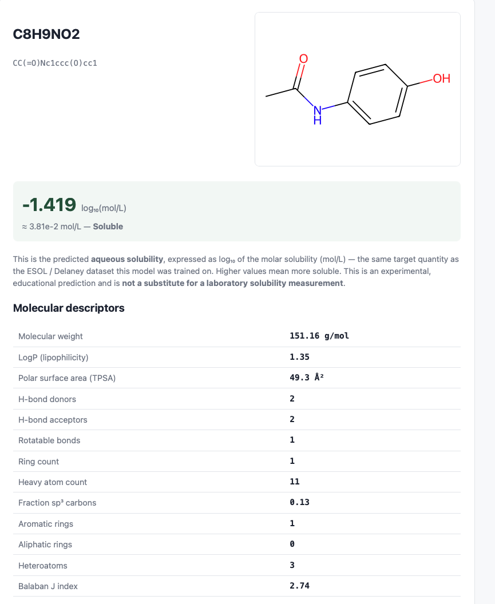
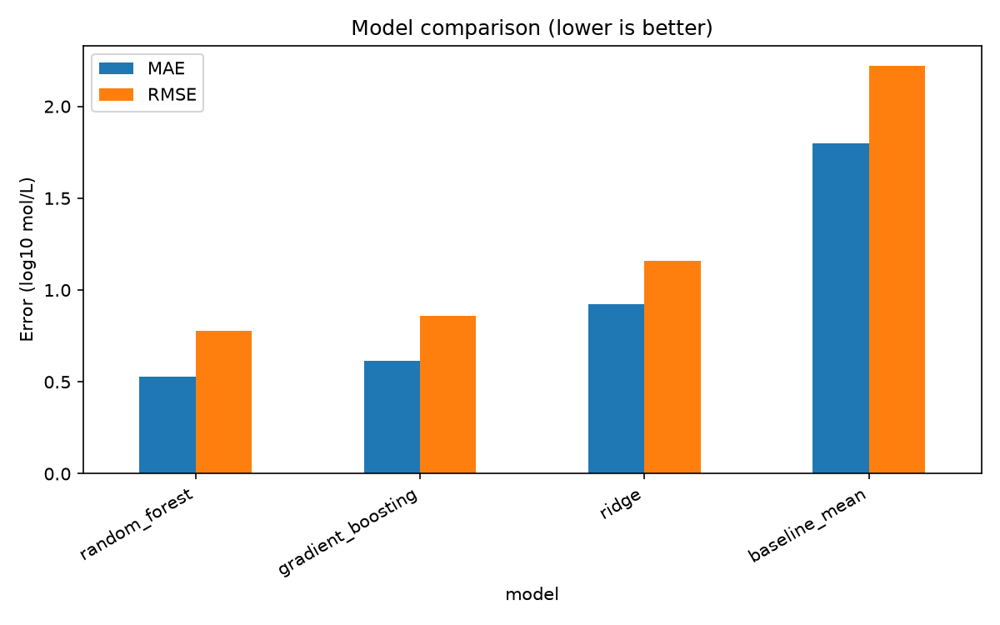
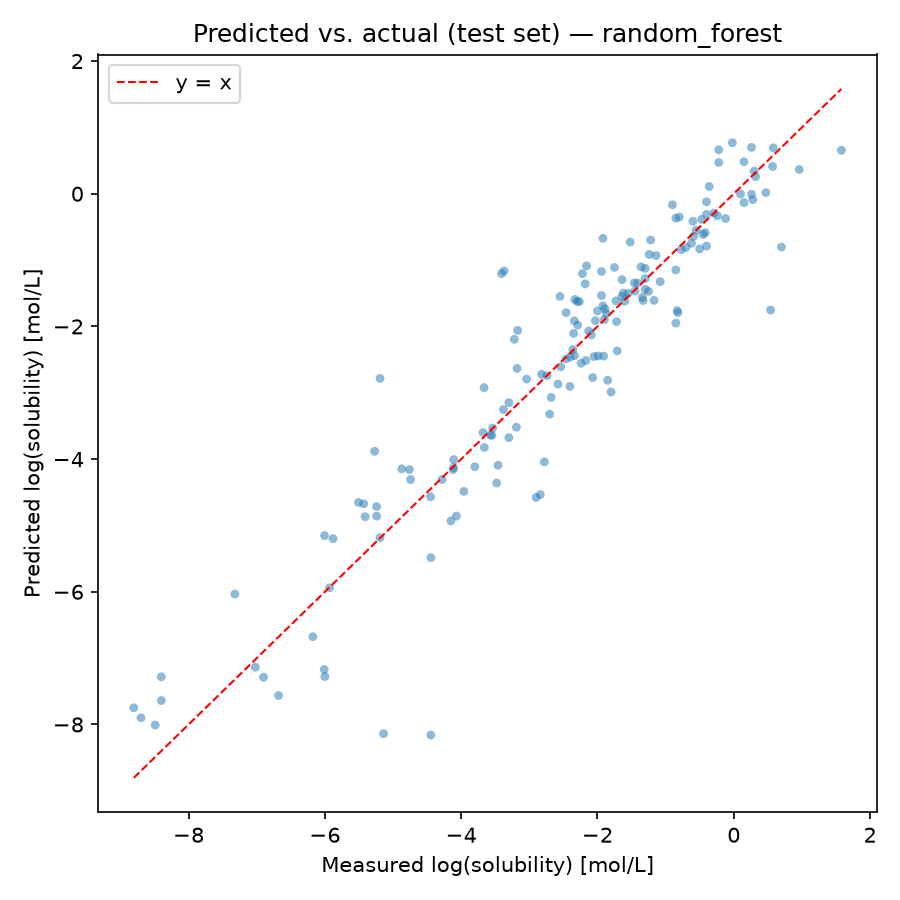
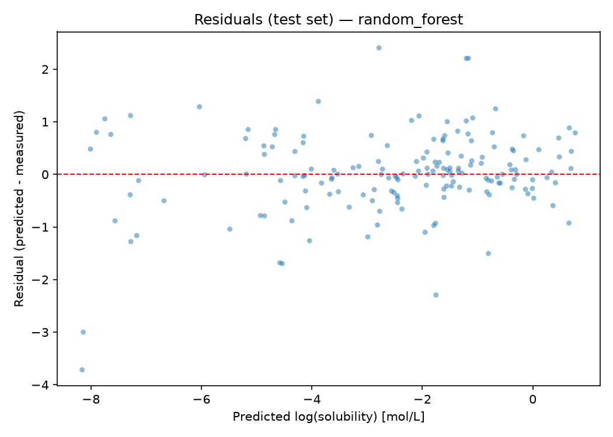

# Molecular Property Prediction Platform

An end-to-end cheminformatics application that predicts the **aqueous solubility (LogS)** of small organic molecules from a SMILES string.

A React frontend talks to a FastAPI backend, which validates the molecule with RDKit, computes physicochemical descriptors, runs a scikit-learn model and stores each prediction in PostgreSQL. The model is trained by a separate offline pipeline on the ESOL (Delaney) dataset and evaluated on a scaffold-held-out test set.

**Scaffold-split test performance (n = 167): MAE 0.530 · RMSE 0.778 · R² 0.865**

---

## Key capabilities

- **SMILES → LogS prediction** with RDKit validation and canonicalization; invalid input returns `422`, not a server error.
- **Scaffold-aware evaluation**: Bemis–Murcko scaffold split, scaffold-grouped cross-validation, and explicit leakage checks.
- **Canonical duplicate aggregation**: structures that resolve to the same canonical SMILES are merged before splitting.
- **Train/serve consistency**: the serialized model carries its feature metadata, and descriptor compatibility is checked when the model is loaded.
- **Full application stack**: FastAPI + PostgreSQL prediction history, 2D structure rendering, and a React UI, validated end-to-end with Docker Compose.
- **32 automated Python tests** covering the ML pipeline, chemistry services and API.

## Screenshot



*Paracetamol prediction from the running application: predicted LogS, the mol/L conversion, the RDKit structure and the model's input descriptors. The value is a model prediction, not an experimental measurement.*

## Architecture

```
React (Vite, served by nginx)
        │  REST/JSON
        ▼
FastAPI backend ──────────────▶ PostgreSQL
        │                        (prediction history, Alembic migrations)
        ▼
Shared ml/ package
  RDKit validation & canonicalization
  descriptor calculation
  model loading & inference
        ▲
        │ loads
models/solubility_model.joblib   ◀── produced offline by scripts/train_model.py
                                      from data/raw/delaney.csv
```

Training and serving share the same `ml/` package, so descriptor calculation is identical in both paths. See [`docs/architecture.md`](docs/architecture.md) for the design rationale.

## ML methodology

### Dataset

[ESOL (Delaney)](data/README.md) aqueous solubility dataset: 1,144 source rows. The target is the measured log₁₀ aqueous solubility in mol/L. The raw CSV is included at `data/raw/delaney.csv`.

### Preprocessing

| Step | Rows |
|---|---|
| Raw dataset | 1,144 |
| After removing missing values and exact duplicates | 1,138 |
| After RDKit SMILES validation (1 invalid SMILES removed) | 1,137 |
| After canonical duplicate aggregation | **1,116** |

Each valid SMILES is converted to an RDKit canonical SMILES. Different input strings can describe the same molecule. If those rows were kept separately, the model would see identical feature vectors, sometimes with conflicting targets, and repeated structures would carry extra weight in training and evaluation. Repeated canonical structures are therefore collapsed into a single observation using the **median** measured LogS.

### Splitting

The default and reported evaluation uses a **Bemis–Murcko scaffold split**, keeping scaffold groups disjoint across the train, validation and test sets. This gives a stricter evaluation than a random split, where structurally related molecules can more easily appear on both sides.

| Split | Molecules |
|---|---|
| Train | 782 |
| Validation | 167 |
| Test | 167 |

Scaffold overlap between splits and canonical-molecule leakage are both checked explicitly (and covered by tests). A random split is implemented for comparison (`--split random`) but is not the primary reported evaluation.

### Hyperparameter tuning

Hyperparameter search uses cross-validation grouped by scaffold:

- `GroupKFold` is used whenever groups are supplied.
- The number of folds adapts automatically when there are fewer unique groups than requested folds; at least two unique groups are required.
- The model layer stays generic: it accepts a `groups` array and has no knowledge of SMILES or RDKit.

### Model selection and evaluation

Four candidates are compared:

- `DummyRegressor` baseline (predicts the training mean)
- Ridge regression
- Random Forest
- Gradient Boosting

The model family is selected **on validation-set performance only**. The selected model is then refit on train + validation and evaluated **once** on the untouched test set.

Seeds are fixed (`RANDOM_SEED = 42`) for splitting, model initialization and cross-validation.

## Results

### Validation set (used for model selection)

| Model | MAE | RMSE | R² |
|---|---|---|---|
| Baseline (mean) | 1.797 | 2.221 | −0.029 |
| Ridge | 0.922 | 1.157 | 0.721 |
| **Random Forest** | **0.529** | **0.778** | **0.874** |
| Gradient Boosting | 0.615 | 0.862 | 0.845 |



### Test set (final evaluation, scaffold-held-out)

Random Forest, refit on train + validation, evaluated once on the 167 test molecules:

| MAE | RMSE | R² |
|---|---|---|
| 0.530 | 0.778 | 0.865 |

Test performance remained close to validation performance.

The fitted configuration resulting from the grouped hyperparameter search is `n_estimators=200`, `max_depth=16`, `min_samples_leaf=1` (`random_state=42`).

| Predicted vs. actual (test) | Residuals (test) |
|---|---|
|  |  |

Running the training pipeline also writes the largest-error test molecules to `data/processed/worst_predictions_test.csv` for error analysis.

## Molecular features

The model uses 13 RDKit 2D descriptors, chosen to cover the size, lipophilicity, polarity and rigidity factors that classically drive solubility, rather than all 200+ descriptors RDKit provides.

| Descriptor | Captures |
|---|---|
| `MolLogP` | Lipophilicity (Crippen logP); typically the strongest single predictor of low solubility |
| `MolWt`, `HeavyAtomCount` | Molecular size |
| `TPSA` | Polar surface area |
| `NumHDonors`, `NumHAcceptors` | Hydrogen-bonding capacity with water |
| `NumHeteroatoms` | Heteroatom content, related to polarity |
| `NumRotatableBonds` | Flexibility |
| `RingCount`, `NumAromaticRings`, `NumAliphaticRings` | Ring content, related to rigidity and crystal packing |
| `FractionCSP3` | Degree of saturation |
| `BalabanJ` | Topological shape/branching index |

The serialized model stores its feature names and order. At inference time the feature matrix is rebuilt in that order, and loading fails with a clear error if the configured descriptor set does not match the one the model was trained on.

Morgan fingerprint featurization is also implemented (`ml/features/fingerprints.py`); the reported model uses descriptors only.

## Application and API

Base path: `/api/v1`. Interactive OpenAPI docs are served at `/docs`.

| Method | Path | Description |
|---|---|---|
| `GET` | `/health` | Model-loaded status and database connectivity |
| `POST` | `/predict` | Predict LogS for a SMILES string and store the prediction |
| `GET` | `/predictions` | Prediction history, newest first (`limit`, `offset`) |
| `GET` | `/predictions/{id}` | A single stored prediction |
| `GET` | `/predictions/{id}/structure` | 2D SVG structure of a stored prediction |
| `GET` | `/visualize?smiles=...` | 2D SVG structure for any SMILES (not stored) |

For each prediction the backend validates and canonicalizes the SMILES, computes the molecular formula and descriptors, predicts LogS, converts it to mol/L and returns model/evaluation metadata.

Error handling:

- Invalid SMILES → `422` with a descriptive message.
- Missing model artifact → `503` explaining that the model must be trained first.
- Unhandled errors → `500` with a generic body; details are logged server-side only.

Example:

```bash
curl -X POST http://localhost:8000/api/v1/predict \
  -H "Content-Type: application/json" \
  -d '{"smiles": "CCO"}'
```

```json
{
  "id": "…",
  "original_smiles": "CCO",
  "canonical_smiles": "CCO",
  "molecular_formula": "C2H6O",
  "descriptors": { "MolWt": 46.07, "…": "…" },
  "predicted_log_solubility": 1.088,
  "predicted_solubility_mol_per_l": 12.24,
  "model_info": { "model_name": "random_forest", "split_strategy": "scaffold", "test_metrics": { "…": "…" } },
  "created_at": "…"
}
```

The **frontend** wraps the API with a SMILES input and example molecules, and shows the predicted LogS, the mol/L concentration, a human-readable solubility category, the 2D structure, the descriptor values, model/evaluation details and the prediction history.

## Tech stack

| Layer | Technology |
|---|---|
| Cheminformatics | RDKit |
| Machine learning | scikit-learn, pandas, NumPy, matplotlib |
| Backend | FastAPI, Pydantic, SQLAlchemy, Alembic |
| Database | PostgreSQL |
| Frontend | React 18, Vite, nginx (production container) |
| Testing & quality | pytest, FastAPI `TestClient`, Ruff, ESLint |
| Infrastructure | Docker, Docker Compose, GitHub Actions |

## Getting started

### Prerequisites

- Python 3.11+
- Docker and Docker Compose
- Node.js 20.19+ or 22.12+ (only for running the frontend outside Docker)

The trained model is **not** committed to the repository. You produce it locally by running the training pipeline, which takes about a minute on a laptop.

### Run with Docker Compose (recommended)

```bash
git clone <repo-url>
cd molecular-property-prediction
cp .env.example .env

python -m venv .venv
source .venv/bin/activate          # Windows: .venv\Scripts\activate
pip install -r requirements.txt

python scripts/train_model.py      # or: make train
docker compose up --build          # or: make docker-up
```

| Service | URL |
|---|---|
| Frontend | http://localhost:5173 |
| API | http://localhost:8000 |
| API docs | http://localhost:8000/docs |

The backend mounts `./models` read-only, so after retraining, `docker compose restart backend` picks up the new model without rebuilding the image. Stop the stack with `make docker-down`.

Training options:

```bash
python scripts/train_model.py --quick          # fast smoke run with small search grids
python scripts/train_model.py --split random   # random split, for comparison only
```

### Local development

```bash
# 1. PostgreSQL (the Compose database service is enough)
docker compose up db

# 2. Backend (from the repository root, with the virtualenv active)
pip install -r backend/requirements.txt
cd backend && alembic upgrade head && cd ..
make backend-dev                   # uvicorn on http://localhost:8000

# 3. Frontend (separate terminal)
cd frontend
npm install
cp .env.example .env
npm run dev                        # http://localhost:5173
```

The model must be trained (`python scripts/train_model.py`) before the backend can serve predictions; otherwise `/predict` returns `503`.

## Testing and quality

```bash
make test           # full Python suite
make test-ml        # ML pipeline tests
make test-backend   # backend/API tests
```

The suite has **32 passing tests**, covering:

- **Chemistry and preprocessing**: SMILES validation, canonicalization, descriptor generation, canonical duplicate aggregation
- **Splitting**: scaffold splitting, reproducibility, scaffold and molecule leakage prevention
- **Modeling**: grouped and ungrouped fitting, `GroupKFold` behavior with few groups, end-to-end pipeline behavior
- **Backend**: chemistry service, request/response schemas, prediction and history endpoints, SVG rendering, health checks, model-unavailable (`503`) behavior

Backend tests use an in-memory SQLite database and a stub model, so they need neither PostgreSQL nor a trained model.

Other checks:

- Ruff: passing
- ESLint: passing
- Production Vite build: passing
- `npm audit`: 0 vulnerabilities

A GitHub Actions workflow (`.github/workflows/ci.yml`) runs linting, tests and the frontend build.

The complete Docker Compose stack has been built and run locally, and a full request path was verified: browser → React → FastAPI → RDKit descriptors → trained Random Forest → PostgreSQL → response rendered in React, with `/health` reporting the model loaded and the database connected.

## Project structure

```
.
├── ml/                     # Shared ML package (training + inference)
│   ├── data/               # loading, SMILES validation, splitting
│   ├── features/           # RDKit descriptors, Morgan fingerprints
│   ├── models/             # training, evaluation, model registry
│   └── inference.py        # model loading and prediction
├── scripts/                # train_model.py, download_data.py
├── tests/                  # ML pipeline tests
├── backend/                # FastAPI app, Alembic migrations, API tests, Dockerfile
├── frontend/               # React + Vite app, nginx Dockerfile
├── data/
│   ├── raw/delaney.csv     # ESOL dataset (committed)
│   └── processed/          # generated splits and reports (git-ignored)
├── models/                 # generated model artifacts (git-ignored)
├── docs/
│   ├── architecture.md
│   ├── plots/              # evaluation plots (committed)
│   └── screenshots/
├── .github/workflows/ci.yml
├── docker-compose.yml
├── Makefile
├── requirements.txt
└── .env.example
```

The repository also includes an exploratory notebook. See [`docs/architecture.md`](docs/architecture.md) for an annotated layout.

**Not committed (generated or local):** the `.joblib` model, generated model metadata and metrics JSON, processed train/validation/test CSVs, prediction and error-analysis CSVs, `node_modules/`, `dist/`, virtual environments and `.env`. The evaluation plots in `docs/plots/` are committed so results are visible without retraining.

## Limitations

- **Dataset size.** About 1.1k unique molecules is small; metric estimates carry meaningful uncertainty.
- **Representation.** 2D descriptors do not encode 3D conformation or solid-state properties explicitly.
- **Applicability domain.** Predictions for chemistry unlike ESOL (large biomolecules, organometallics, unusual scaffolds) may be unreliable, and there is no formal applicability-domain check yet.
- **No uncertainty estimates.** The model returns point predictions without calibrated intervals.
- **Experimental conditions.** Measured solubility depends on pH, temperature, ionization state and crystal form/polymorphism, none of which the model takes as input.
- **Model estimates only.** Predictions are not a substitute for experimental measurement.

## Future improvements

- Applicability-domain / similarity-to-training-set warnings
- Uncertainty estimation (e.g. per-tree variance or quantile models)
- Additional representations and models, such as fingerprint or combined feature sets
- Larger curated solubility datasets
- Experiment tracking and model versioning

## License

This project is released under the MIT License — see [LICENSE](LICENSE). The ESOL dataset is distributed under its own license; see [`data/README.md`](data/README.md).
