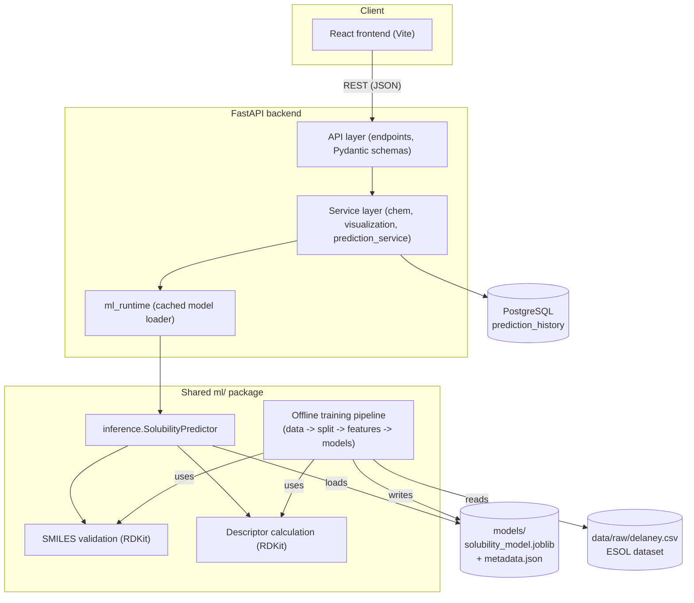

# Architecture

## System overview



## Design decisions and why

**One `ml/` package, two callers.** The exact same SMILES-validation and
descriptor-computation code (`ml.data.validation`, `ml.features.descriptors`) is used
by both the offline training script (`scripts/train_model.py`) and the online
inference path (`ml.inference.SolubilityPredictor`, called from the backend). This is
the single most important structural decision in the project: it makes train/serve
skew (a model behaving differently in production than it did during evaluation)
structurally hard to introduce by accident, rather than something you have to
remember to keep in sync by convention.

**Backend layering.** `api/` (HTTP concerns only) → `services/` (business logic,
framework-agnostic) → `ml/` + `db/` (the two things services orchestrate). This means
`prediction_service.create_prediction` can be unit-tested, or called from a future CLI
or batch job, without touching FastAPI at all — and conversely, a FastAPI endpoint
function is never more than a few lines translating HTTP request/response into a
service call.

**Model artifact as a mounted volume, not baked into the image at request time.** The
backend Docker image copies whatever is in `models/` at *build* time, and
docker-compose additionally mounts `./models` read-only into the running container.
That means retraining the model on the host (`python scripts/train_model.py`) and
restarting the backend container picks up the new model without a full image rebuild
— a small but genuinely useful bit of iteration speed during development.

**Alembic *and* `Base.metadata.create_all()`.** For a single-developer portfolio
project with one table, a full migration history might look like overkill — but
`alembic/` is included and is the "real" way to evolve the schema (and the thing a
reviewer would expect to see). `create_all()` also runs at backend startup purely as a
convenience so `docker compose up` works on a completely fresh database without an
extra manual `alembic upgrade head` step; in a production deployment you'd run
migrations explicitly as part of the deploy and could remove the `create_all()` call.

**Why not a graph neural network / deep learning model.** ESOL has ~1,100 molecules.
Classical ML (regularized linear models, tree ensembles) on a well-chosen descriptor
set is the appropriate, evidence-based tool at this data scale — published comparisons
(e.g. Pat Walters' "Predicting Aqueous Solubility — It's Harder Than It Looks") find
simple models remain very competitive with far more complex ones on ESOL-scale data.
Adding a GNN here would demonstrate willingness to add complexity, not judgment about
when complexity is warranted — the latter is the more useful signal for an engineering
portfolio.

## Repository layout

```
molecular-property-prediction/
├── ml/                 # Shared cheminformatics + ML package (framework-agnostic)
│   ├── data/           # loading, RDKit SMILES validation, train/val/test splitting
│   ├── features/       # RDKit descriptors + Morgan fingerprints
│   ├── models/         # candidate models, training, evaluation, on-disk registry
│   ├── pipeline.py      # the one place raw data -> feature matrix happens
│   └── inference.py     # the one place a SMILES -> prediction happens
├── scripts/             # CLI entrypoints: download_data / train_model / evaluate_model
├── notebooks/            # EDA + representation-comparison notebook (exploration only —
│                          # no production logic lives here, see ml/ for that)
├── tests/                # ML pipeline tests (pytest)
├── data/                 # raw (checked in) + processed (generated, gitignored) data
├── models/               # trained model artifacts (generated, gitignored)
├── backend/
│   ├── app/
│   │   ├── api/v1/       # HTTP endpoints only
│   │   ├── services/     # business logic (chem, visualization, prediction_service)
│   │   ├── ml_runtime/   # cached model-loading singleton
│   │   ├── db/           # SQLAlchemy models/session
│   │   ├── schemas/      # Pydantic request/response contracts
│   │   └── core/         # settings, logging
│   ├── alembic/          # database migrations
│   └── tests/            # backend API tests (pytest + FastAPI TestClient)
├── frontend/             # React (Vite) single-page app
├── docs/                 # this file, plots, screenshots
└── docker-compose.yml    # db + backend + frontend, one command
```
